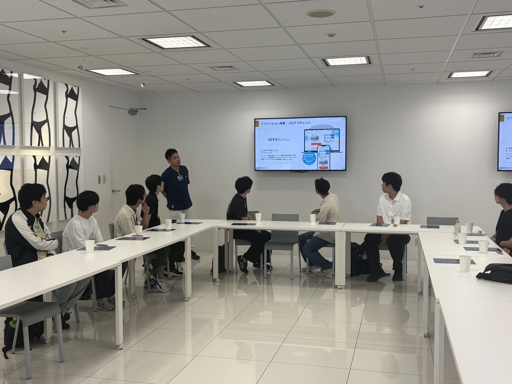
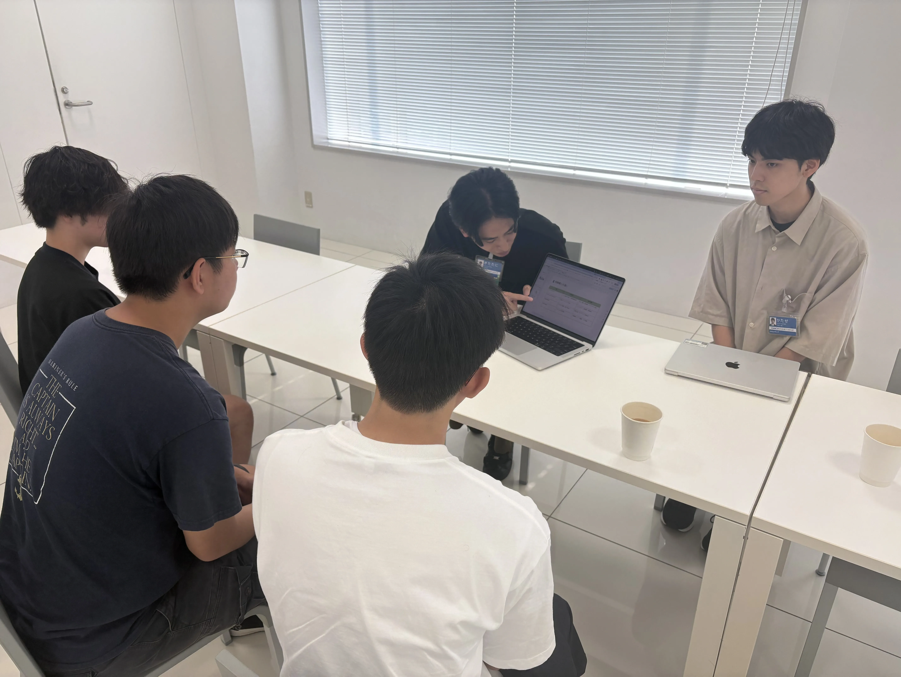
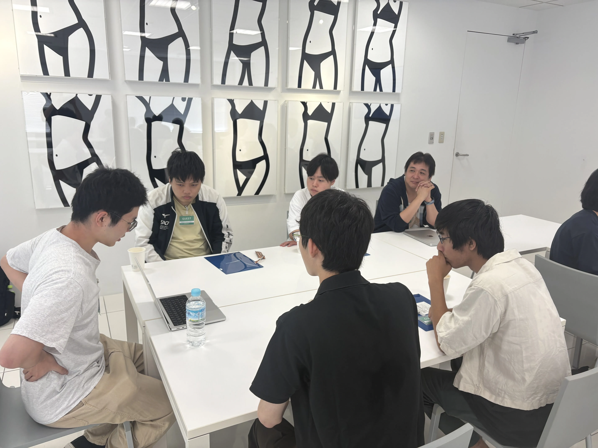

8月22日、ut.code(); の1・2年生を中心に「GMOオフィスツアー&エンジニア座談会」を実施しました。

今回は、GMOメディアさんのご協力のもと、GMOインターネットグループ第１本社セルリアンタワーにて実際にエンジニアが働くオフィスを見学し、現場で活躍される方々からリアルなお話を伺う貴重な機会となりました。

## オフィスツアー

まずは水崎さんのご案内で、オフィスを一通り見学させていただきました。開放的な空間や最新の設備、そして集中して働くエンジニアの姿を間近に見ることで、「エンジニアとして働く」というイメージがぐっと具体的になりました。普段は大学の中だけで活動している私たちにとって、現場の雰囲気を直接感じられたことは大きな収穫でした。

## 会社説明 & エンジニア組織紹介

続いて、別府さんから会社説明と組織紹介をしていただきました。

GMOインターネットグループ全体の事業概要から、GMOメディア独自の取り組み、AIを活用した開発事例や新規サービス立ち上げの裏側まで幅広いお話がありました。リモートとオフィスを組み合わせた柔軟な働き方についても伺い、就業環境のリアルを知ることができました。

## エンジニア座談会

その後は3つのグループに分かれて、エンジニアの方々との座談会に参加しました。テーマごとに15分のトークと5分のQ&Aを回る形式で、どの話もとても濃い内容でした。

・北谷さん：「エンジニアマネージャーになるということ」

ご自身のキャリアを交えながら、GMOメディアにおけるEMとしての役割や目指したきっかけ、やりがいについて伺いました。

・日暮さん：「自社開発プロダクトの新規立ち上げプロセス」

「コエテコ授業管理」を例に、0→1でプロダクトを生み出す過程をリアルに解説していただきました。どのような背景でサービスが生まれ、どんな技術を選定し、いかにスピー
ディーにリリースまで繋げたのかを学ぶことができました。

・岡田さん：「AI時代のプロダクト開発」

学生起業からAIスペシャリストへと歩まれた経験を背景に、AIを活用した開発の実例や今後の展望についてお話しいただきました。ChatGPTをはじめとした最新技術が、実際のサービス開発にどのように組み込まれているのかを知ることができました。

## 参加した学生の声

「エンジニアとして働く将来像がより具体的に描けた」、「AIや新規事業など最先端の話が聞けて刺激になった」、「キャリアの選択肢が広がった」など、多くの前向きな感想が寄せられました。

## まとめ

今回のオフィスツアーと座談会を通して、参加者はエンジニアのリアルな働き方やキャリアの多様性を体感することができました。ut.code(); では、今後もこのような実践的な学びの機会を企画していきます。

改めて、今回ご協力いただいたGMOメディアの皆さま、ありがとうございました！