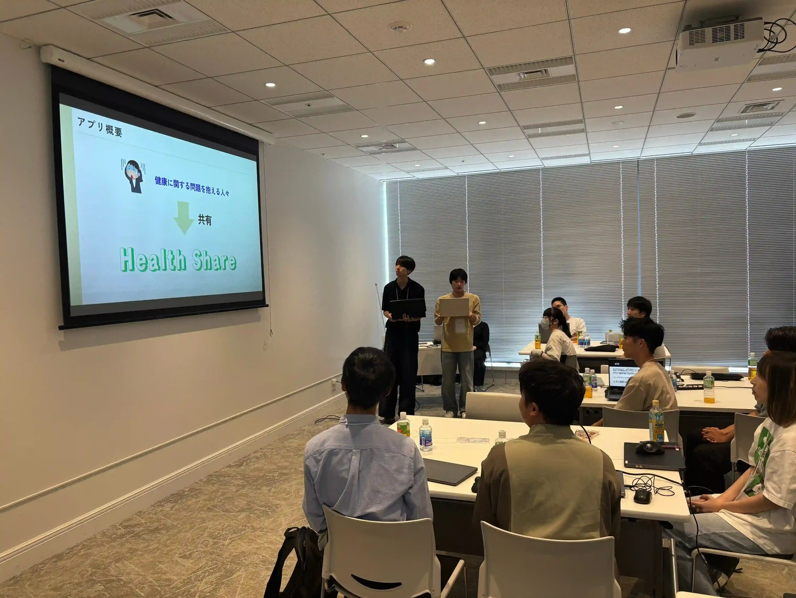

ut.code(); では９月３０日（火）に[RIZAPテクノロジーズ株式会社](https://www.rizap-tech.co.jp/)と合同で、健康×テクノロジーをテーマにしたハッカソンを開催しました。

**🔥最強の健康革命を起こせ-技術とカラダで未来を変えろ！🔥**

**「あなたの手で、誰かの健康習慣を劇的に変革せよ」**

というテーマのもと、2週間という限られた時間で企画から開発までを駆け抜けました。どのチームも完成度が高く、レベルの高い発表が繰り広げられました。
以下では、各チームの成果物をご紹介します。

## チーム D一族
チームD一族は、トレーニング時間の記録に特化した「STACK UP」を開発しました。トレーニングの「内容・回数」ではなく、「時間」をメインとしていて、どんなトレーニングした人とも共通の軸で比較することができます。また、毎日の積み重ねが可視化され、日々のモチベーションを維持することができます。

## チーム DAKAI
チームDAKAIはゲーマーをターゲットとした運動記録共有アプリを開発しました。
目標を達成することによってキャラクターが成長していき、運動+娯楽の形で運動の習慣化につなげます。

## チーム redfox
チームredfoxはデスクワーク中心の現代社会人の健康習慣を作る「Habit Relay」を開発しました。エンジニアなどのオフィスワーカーが使うことを目的としており、少数のグループを作り、小さな健康習慣をリレー形式で続けるアプリです。

## チーム 少年サッカー
チーム少年サッカーは忙しい社会人をターゲットとした健康モチベーショアプリ「Health Share」を開発しました。同じ悩みを持つ利用者同士のコミュニティ形成、AIによる隙間時間向け運動メニュー提案、ユーザーの体系の3Dモデル表現によって、強力なモチベーションを生み出します。

## 最優秀賞 チーム 少年サッカー
最優秀賞は「Health Share」を開発したチーム少年サッカーでした！
チーム少年サッカーには賞金6万円が贈呈されました。

## 優秀賞 チーム D一族
優秀賞は「STACK UP」を開発したチームD一族でした！
チームD一族にはチョコちゃんのステッカーとTシャツが贈呈されました。

## まとめ
今回のハッカソンでは、参加者の柔軟な発想と技術力が融合し、多様なアプローチから「健康習慣を変える」プロダクトが生まれました。
審査員からも「実用性が高い」「継続性の工夫が素晴らしい」と高い評価をいただき、短期間ながら熱気あふれるイベントとなりました。

イベントの最後には、懇親会も開かれ、RIZAPテクノロジーズ株式会社の社員の方々や参加者同士で交流が深まり、ハッカソンを通じた学びとつながりを実感できる時間となりました。

共催いただいたRIZAPテクノロジーズ株式会社の皆さま、そして参加者の皆さま、本当にありがとうございました！

RIZAPテクノロジーズ株式会社では[インターンシップ](https://kikaku-recruit.rizap.jp/rzt_engineer_internship)も行われておりますので、興味のある方はぜひ覗いてみてください！