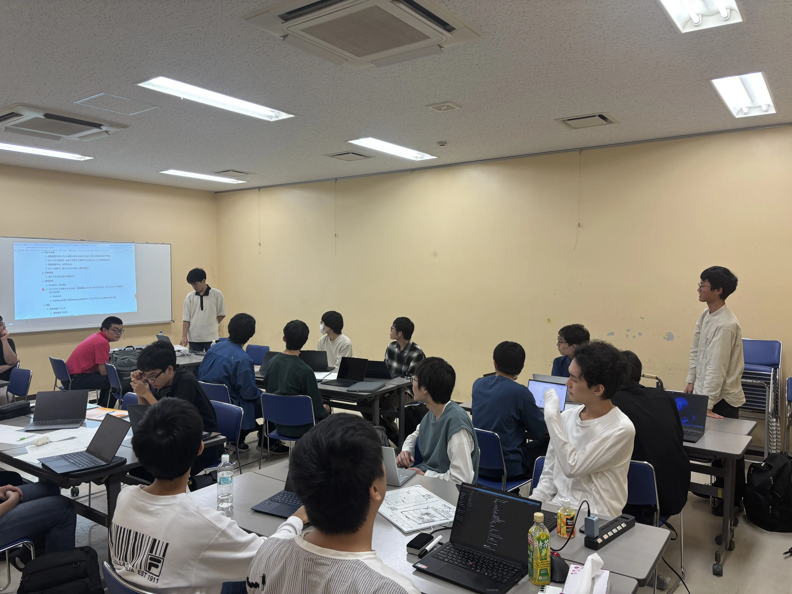

ut.code(); では１０月１１日（土）に第76回駒場祭に向けたキックオフミーティングを開催しました。

今回のミーティングでは、駒場祭に展示するプロジェクトを立ち上げました。今年度サークルに入った4期生を中心に、5つのチームに分かれて開発します！

各プロジェクトが駒場祭に向けて、何を開発していくのか紹介します。

## 8番ページ
8番出口のコンセプトを取り入れたゲームです。Webページ内の異変を見つけて、異変があったら前のページに引き返すといったイメージの企画です。

## Life Code
ライフゲームを楽しんでもらう企画です。純粋にライフゲームを遊んで楽しんだり、ライフゲームのコードを編集することでプログラミングを体験してもらいます。

## Shooting Game
インベーダーゲームのようなシューティングゲームです。コードを編集すると、スマートにゲームをクリアすることでができる要素をつけて、プログラミングを体験しれもらう企画です。

## ブラウザハック入門
開発者ツールでコードを編集することで、問題を解決していくような企画です。ハッキングについて体験してもらうことを想定しています。

開発していく中で一部内容に変更が加えられることがあると思いますが、おおよそのコンセプトとしては上記の通りとなります。

[ut.code();学園祭ウェブサイトはこちら](https://festival.utcode.net/)

[第76回駒場祭公式ページはこちら](https://www.komabasai.net/76/visitor/)

