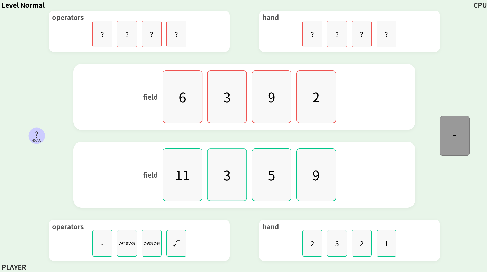
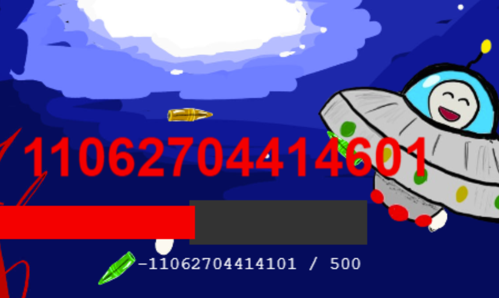
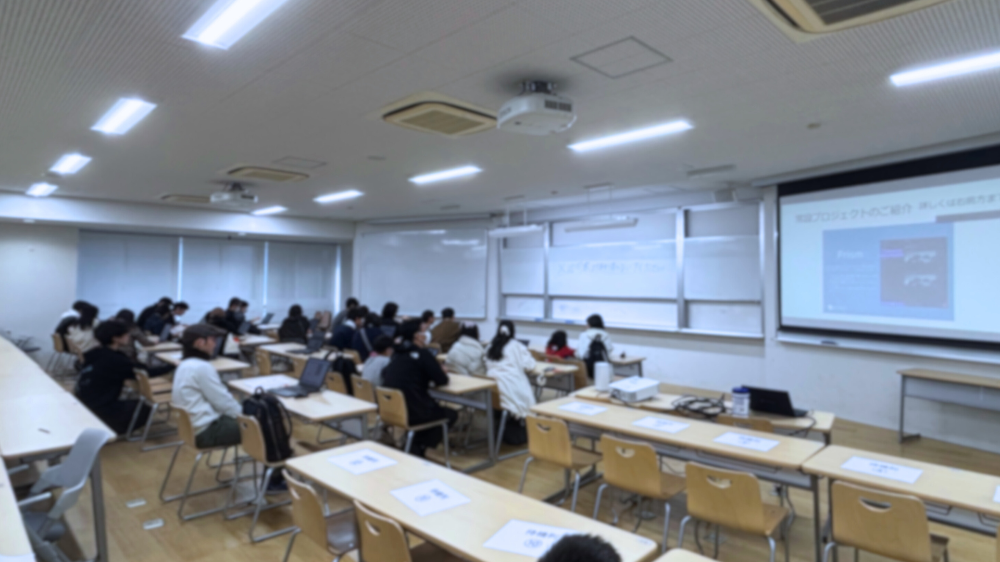

ut.code(); は、2025 年 11 月 22 〜 24 日 に開催された駒場祭において、企画「あなたのためのプログラミング」を出展しました。
お越しくださった皆様、ありがとうございました！

今回の駒場祭で展示した内容は、以下の特設サイトからご覧いただけます。

[https://kf76.utcode.net/](https://kf76.utcode.net/)

今回は、定番企画「はじめてのプログラミング 迷路」などに加え、新入生が中心となって開発した計 5 つの新規企画を展示しました。

これらの新規企画は、[駒場祭キックオフミーティング](./10-11_komaba-festival-kickoff) にて開発がスタートしました。

## 新規企画の内容

### [プラス演算子ゲーム](https://plusoperatorgame.onrender.com/)
手札の数字と四則演算やビット演算などの演算子を用いて、相手の場にあるカードの値をすべて 1 にするパズルゲームです。

### [8番ページ](https://page8.utcode.net/)
Web上の8番出口をモチーフにしています。Webページ内の異変を見つけて、異変があったら前のページに引き返します。異変がプログラム上でどのように書かれているかも学べます。

### [Life Code](https://life-code.utcode.net/)
純粋にライフゲームを遊ぶこともできれば、ライフゲームを制御するスクリプトを自分なりに編集して遊ぶこともできます。

### Hack-Shooter (現地のみ)
このシューティングゲーム、そのままだとなかなか手強いです。ゲームの中身を編集してパラメータを変えるなどして、スマートに攻略しましょう。

### ブラウザハック入門 (現地のみ)
開発者ツールでコードを覗き見たり編集したりして、ハッキングの初歩を体験しながら学べます。

改めまして、ご来場ありがとうございました。

ut.code(); は引き続き、五月祭および駒場祭にて展示を続けていきます。

次回の第 99 回五月祭もどうぞよろしくお願いいたします。

