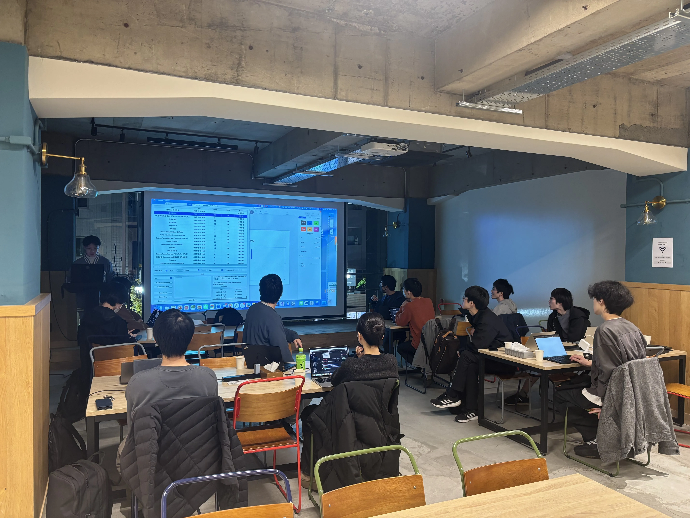
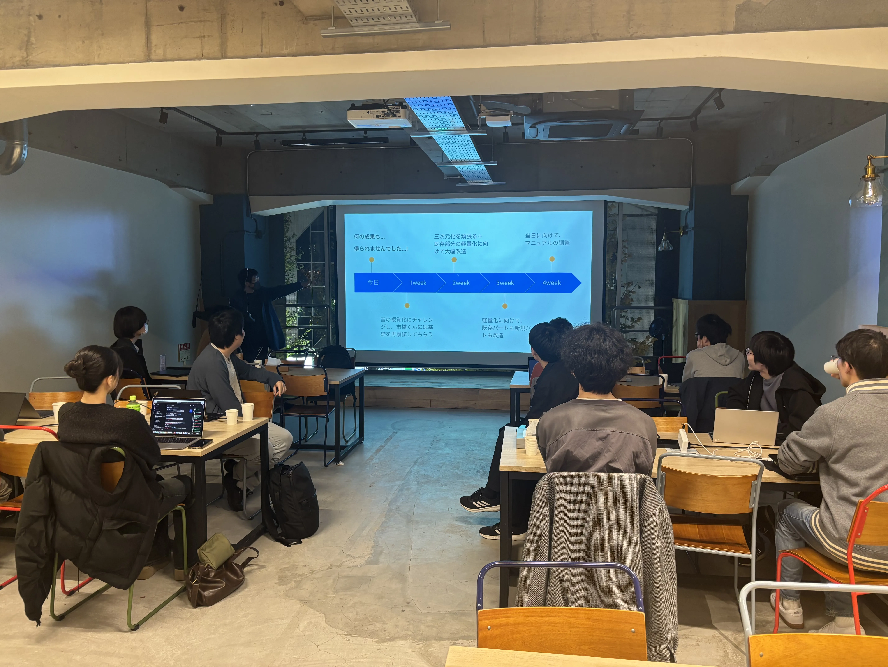
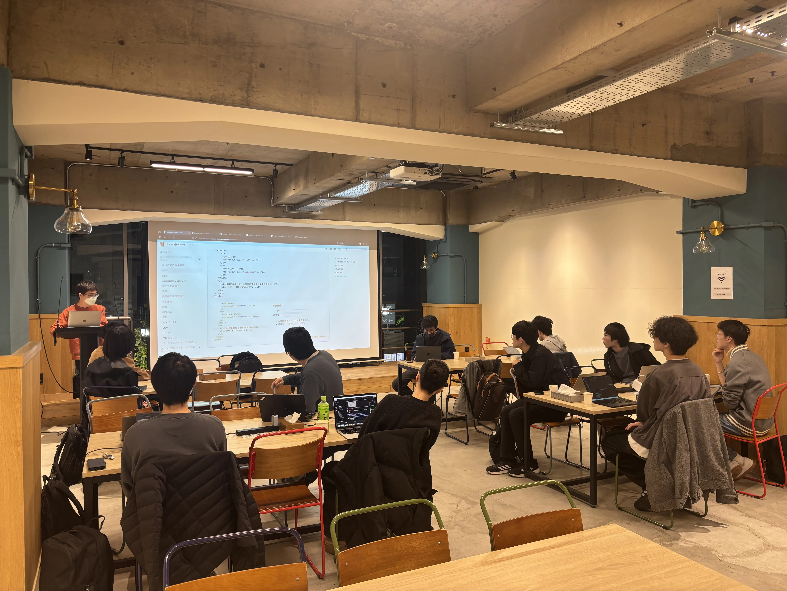

ut.code(); では、11 月 29 日に第 5 回 ut.code(); 総会を行いました。

## 常設プロジェクトからの発表

まずは、年間を通して活動している常設プロジェクトからの発表を行いました。
新たに追加された機能の紹介や、今後の展望の共有、制作したアプリのデモなどを通して、互いに刺激を受ける機会となりました。

## プロジェクト発足会に向けて・アイデアソン

続けて、12 月 13 日に行われるプロジェクト発足会に向けて、アイデアソンを行いました。

### プロジェクト発足会とは？
プロジェクト発足会は、ut.code();のメインの活動となる常設プロジェクトを立ち上げる活動となります。発足されたプロジェクトは、約半年間かけてチームでアプリやゲームの開発に取り組みます。

### アイデアソン
アイデアソンでは、作りたいプロダクト・ターゲット・使用技術・最終目標など様々なことを考えて、各自のアイデアをぶつけ合いました。

議論しながら様々なアイデアを出すことができて、次のプロジェクト発足会が楽しみです！

## おわりに

総会後には、[駒場祭プロジェクト](https://kf76.utcode.net/)の打ち上げを行いました。
次回のut.code();総会は 12 月 13 日に行われる予定です。
