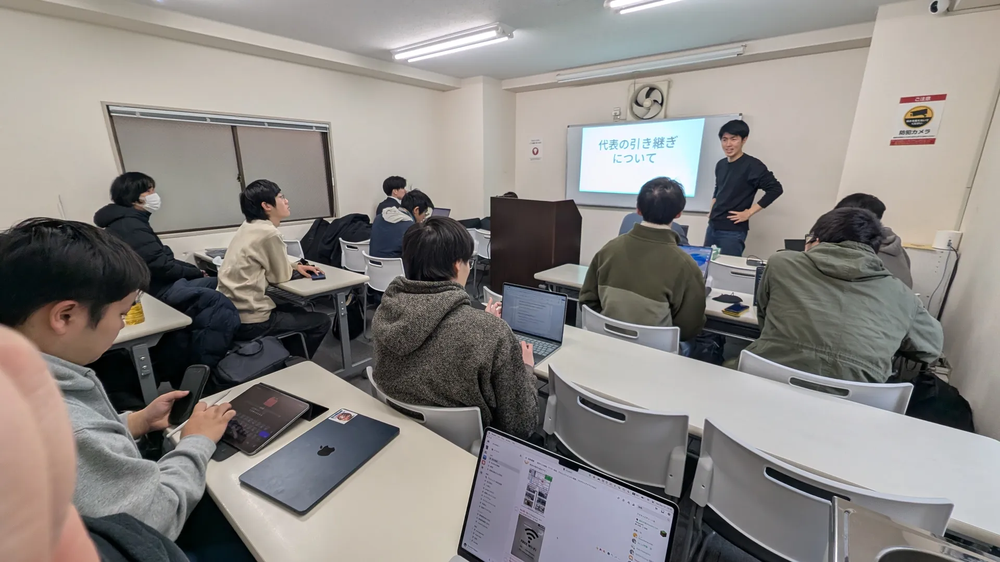
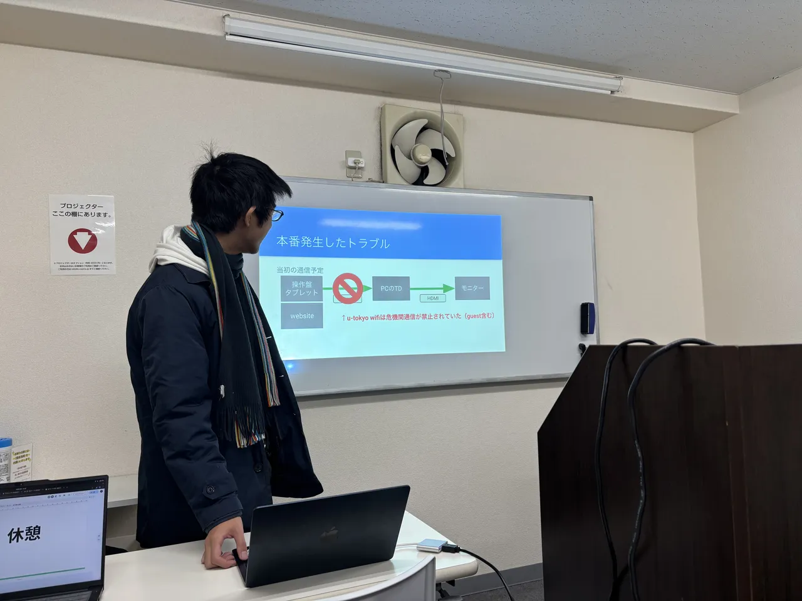
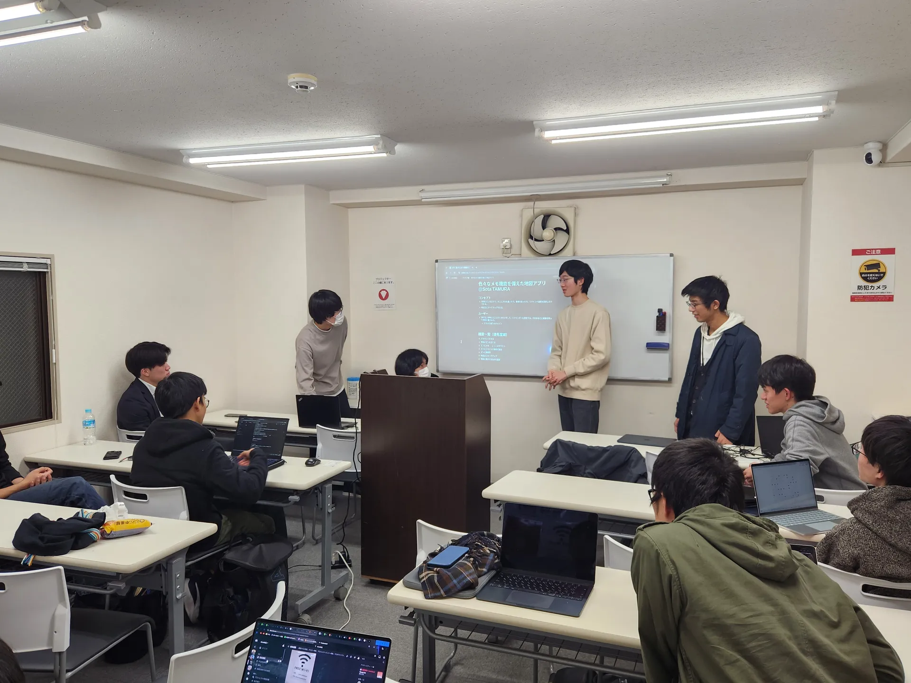

ut.code(); では、12 月 13 日に第 6 回 ut.code(); 総会を行いました。

## 代表交代の挨拶

まずは、代表交代の挨拶を行いました。眞鍋快地から安村拓也へと代表が引き継がれました。代表交代についての詳細は、別途記事を公開予定です。

## プロジェクト発表

続けて、常設プロジェクトからの発表を行いました。
各プロジェクトの進捗や成果を共有し、互いの活動について理解を深める時間となりました。

## プロジェクト発足会

最後に、今回のメインイベントであるプロジェクト発足会を行いました。

プロジェクト発足会は、ut.code(); のメインの活動となる常設プロジェクトを立ち上げる活動です。前回の総会で行ったアイデアソンをもとに、以下の 4 つのプロジェクトが発足しました。

- メモできる地図アプリ
- 宇宙物理シミュレーション
- 音ゲー風回避アクションゲーム
- ネットワーク構築ゲーム

発足されたプロジェクトは、約半年間かけてチームでアプリやゲームの開発に取り組みます。

## おわりに

今年の総会はこれで最後となります。次回の ut.code(); 総会は 2 月 14 日（土）に行われる予定です。来年もよろしくお願いします！
