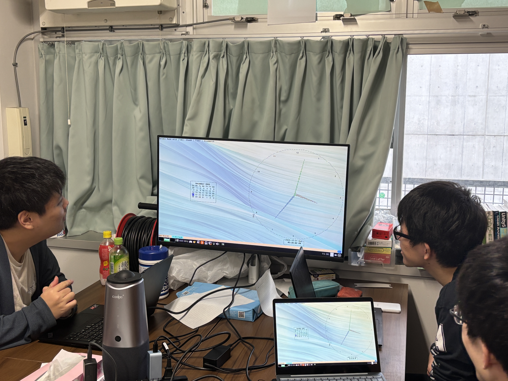

ut.code(); では、12 月にサークルでハッカソンを行いました。

## ハッカソンの概要

今回のハッカソンは、「テーマ×技術縛りハッカソン」と称し、提示されるテーマまたは技術の少なくとも一方を満たすプロダクトを制作する形式で開催されました。

今回の縛りはテーマが「CLIツール」、技術が「Python または Rust」でした。
ut.code(); では多くのプロダクトが TypeScript で作られるため、今回はあえて異なる技術に挑戦する機会を設けました。

## ハッカソンの様子

12 月 6 日にハッカソンのキックオフが行われ、その当日にテーマと技術の縛りが発表されました。
その後、テーマや技術に関する説明が行われました。
技術については Python や Rust で開発する際のポイントや、CLI ツールを作成するためのライブラリについて紹介されました。

キックオフからの 2 週間の期間で、各々の参加者が合間を縫って開発を行いました。

12 月 21 日の発表会では、参加者が集まって各自の制作物を発表しました。
実用的な cron スケジューラーや、日常的に使えるツール、ターミナル上で動作するゲームなど、多様なプロダクトが発表されました。
Rust で CLI ツールを作成した意欲的な参加者が多かったです。

ut.code(); では今後も同様のハッカソンを開催していく予定です。
