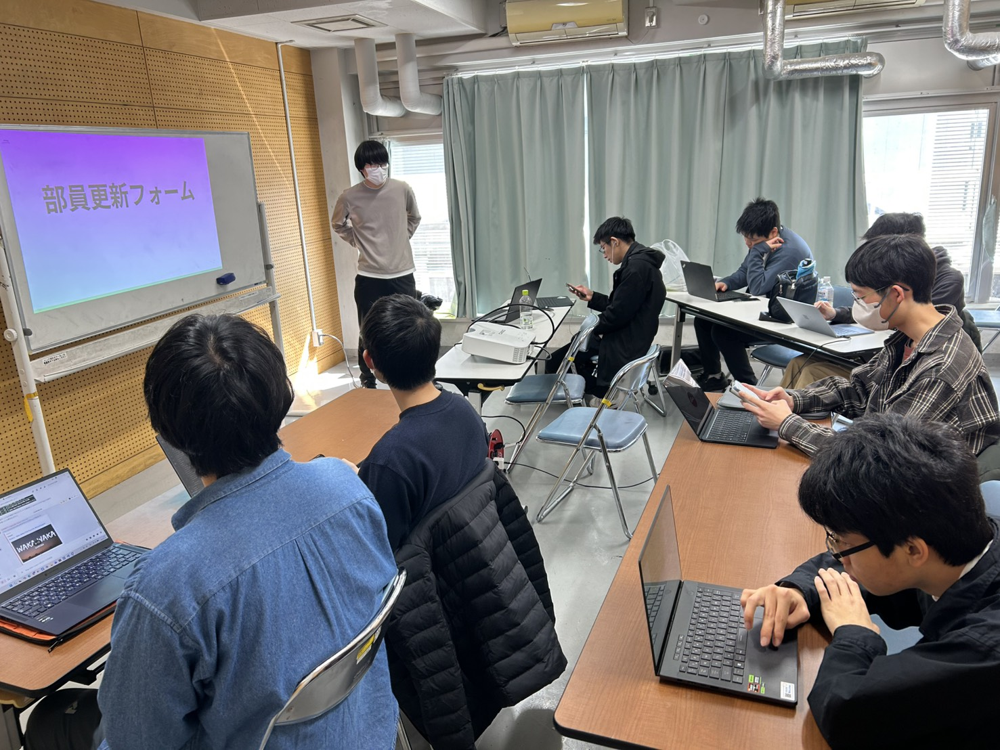
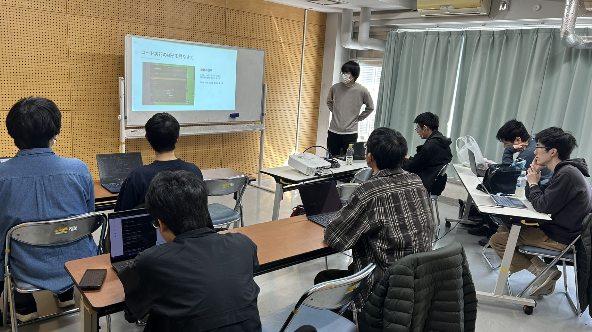
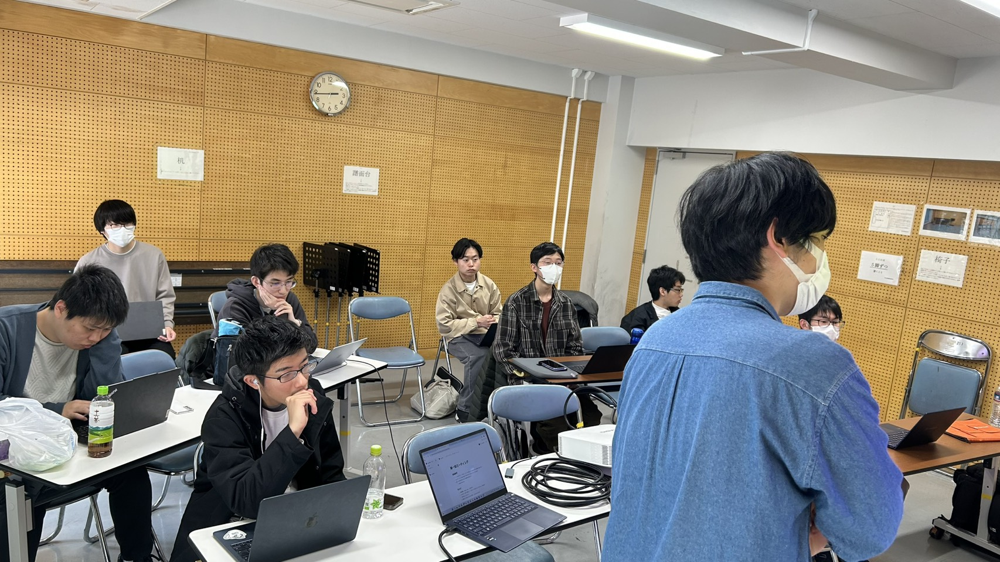
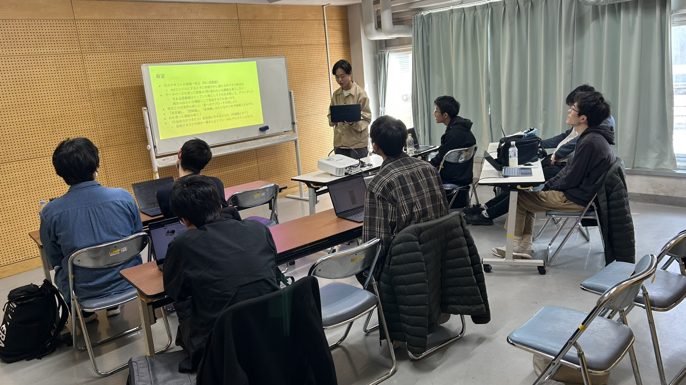

ut.code(); では、3 月 24 日に ut.code(); 総会を行いました。

## 新歓についての連絡

初めに、新歓についての連絡を行いました。
新歓のスケジュールを発表し、新歓のイベントへのスタッフ参加を呼びかけました。

## プロジェクト発表

続けて、常設プロジェクトからの発表を行いました。
それぞれのプロジェクトについて情報交換を行い、活動内容への理解を高める機会となりました。

## 五月祭についての発表

その後、五月祭についての発表を行いました。
第99回五月祭におけるut.code();の場所は「工学部6号館 2階 61号講義室」に決定しました。
そして、今回の五月祭で新規展示する以下の二つのプロジェクトからの発表も行いました。

- アイスクリームゲーム
- ビリヤード

## LT会

最後に、LT会を行いました。
今回は3人の方に発表を行ってもらいました。
開発の際に意識したことや大変だったことなど勉強になるお話を聞かせていただきました。

## おわりに

5期生参加前の総会はこれで最後となり、次回からは5期生も参加しての総会になります。
次回の ut.code(); 総会は 4 月 25 日（土）に行われる予定です。新年度もよろしくお願いします！