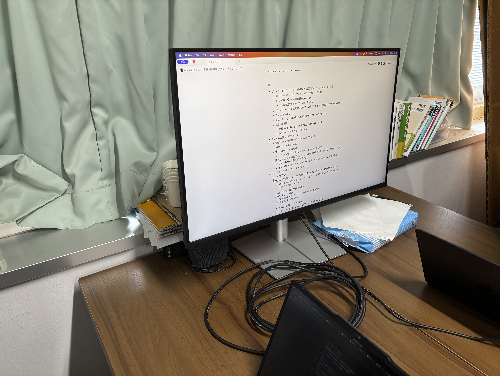

ut.code(); は、3月13日(金)に第99回五月祭のキックオフミーティングを行いました。

ut.code(); では毎年、五月祭で部員たちが作成したゲームやアプリケーションなどを来場者の方に実際にパソコン上で体験していただく展示を行っております。今年の五月祭では、過去の学園祭で人気があった作品に加え、新たにゲームを2つ制作して展示することに決定しました！

ミーティングではまずアイデア出しを行い、多種多様なゲームの案が挙がりました。その中でも特に開発したいと思う部員が多かった以下の2つが、新しく展示するゲームとして決定しました！

## ベルトコンベアでアイスクリームを作るゲーム
アイスのコーンをベルトコンベアに流すと、最終的にお題の通りのアイスクリームができるように、ベルトコンベア上に作業員を配置するというゲームです。プログラミングの考え方にも通じるパズル要素があります。

## リアルなビリヤードゲーム
物理エンジンを用いて、リアルな動きをするビリヤードゲームを制作します。さらに、AIを用いて球の動きをシミュレーションし、効率の良い打ち方を見つける機能も実装する予定です。

次の五月祭では、ut.code(); の企画「あなたのためのプログラミング」に是非足を運んでみてください！