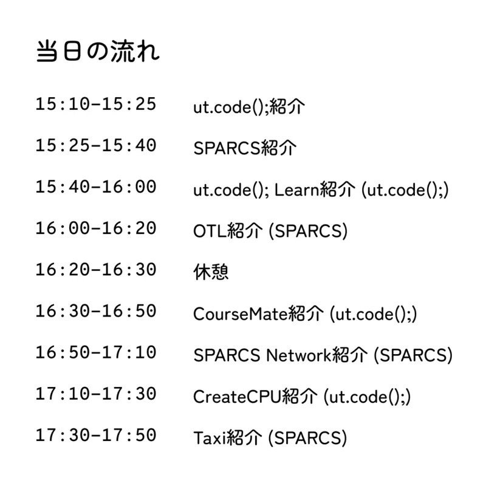

ut.code();では、5月17日（日）に、茨城県立並木中等教育学校で「Webプログラミング講座〜おみくじアプリをつくろう！〜」をテーマにSSH講座を開催しました。

## 概要

茨城県立並木中等教育学校は、茨城県にある公立中高一貫校で、文部科学省のスーパーサイエンスハイスクール（SSH）指定校として、理数教育に力を入れています。

今回の講座は、生徒の興味・関心を広げ、探究活動のきっかけを作ることを目的とした、同校のSSH講座の一環として開催されました。

講座には、中学1年生から高校1年生までの18名の生徒が参加し、プログラミングを基礎から学んだうえで、最終的にはWebアプリケーションの制作に取り組みました。

## これまでの取り組み

今回の講座は、ut.code();が継続的に取り組んできた中高生向けのプログラミング講座の3回目にあたります。

ut.code();では、大学生に限らず、より多くの方にプログラミングの楽しさを知ってもらうことを目指し、2024年から中高生向けのプログラミング講座を開催してきました。中高生向けのプログラミング講座の詳細については、[こちらのページ](/workshop-for-students/)をご覧ください。

並木中等教育学校でのSSH講座は、2024年4月に続き今回が2回目の開催となります。今回の講座では、これまでの講座で得られた経験を活かし、初めてプログラミングに触れる生徒でも手を動かしながらWebアプリケーションの制作に取り組めるよう、内容を設計しました。

## 講座の内容

講座では、ut.code();が独自に開発している中高生向けの教材である[ut.code(); Starter](https://starter.utcode.net/)を用いて、プログラミングを基礎から学び、簡単なWebアプリケーションを制作できるようになることを目指しました。

まず、HTMLを用いてウェブサイトの構造を表す方法を学びました。続いて、CSSを用いて色や配置などの見た目を変える方法を学び、JavaScriptを用いてウェブサイトに動きを与える方法を学びました。それぞれの単元の最後には演習問題に取り組み、学んだ内容を実際に手を動かしながら確認しました。

最後には、それまでに学んだ内容を活用して、カウンターアプリやおみくじアプリの制作に取り組みました。

## 講座の様子

当日は、生徒同士が相談しやすいよう、机をグループごとに配置して講座を進めました。ut.code();からは3名のメンバーが参加し、各グループを巡回しながら、生徒が気軽に質問できるようサポートしました。

講座中は、分からないところがあった際に、隣の人や同じグループの人と教え合いながら進める様子が見られました。また、グループ内で解決できないところについては、すぐに手を挙げてスタッフに質問するなど、主体的に取り組んでいました。

各単元の最後に設けられた演習問題では、問題を解くだけでなく、自分なりに条件を変えたり機能を追加したりしながら、より面白いアプリケーションにしようとする生徒も多く見られました。講座で扱っていない内容についても、検索したり生成AIを活用したりしながら取り入れ、積極的に学びを深めようとする姿が印象的でした。

最後のカウンターアプリやおみくじアプリの制作では、学んだ内容をもとに、自分なりのアイデアを加えながら制作に取り組んでいました。問題文で求められた内容を実装するだけでなく、機能を追加したりデザインを工夫したりするなど、それぞれが試行錯誤を重ねながら、より良いアプリケーションにしようとする姿が見られました。

## 最後に

今回の講座を通じて、参加した生徒の皆さんがプログラミングの楽しさや、自分のアイデアを形にすることの面白さを感じるきっかけになっていれば幸いです。

ut.code();では、今後も大学生に限らず、中高生をはじめとするより多くの方々に向けて、プログラミングに触れ、自分のアイデアを形にする面白さを体験できる機会を提供していきたいと考えています。

最後になりますが、本講座の開催にあたりご協力いただいた並木中等教育学校の先生方、ならびに参加してくださった生徒の皆さんに心より感謝申し上げます。
