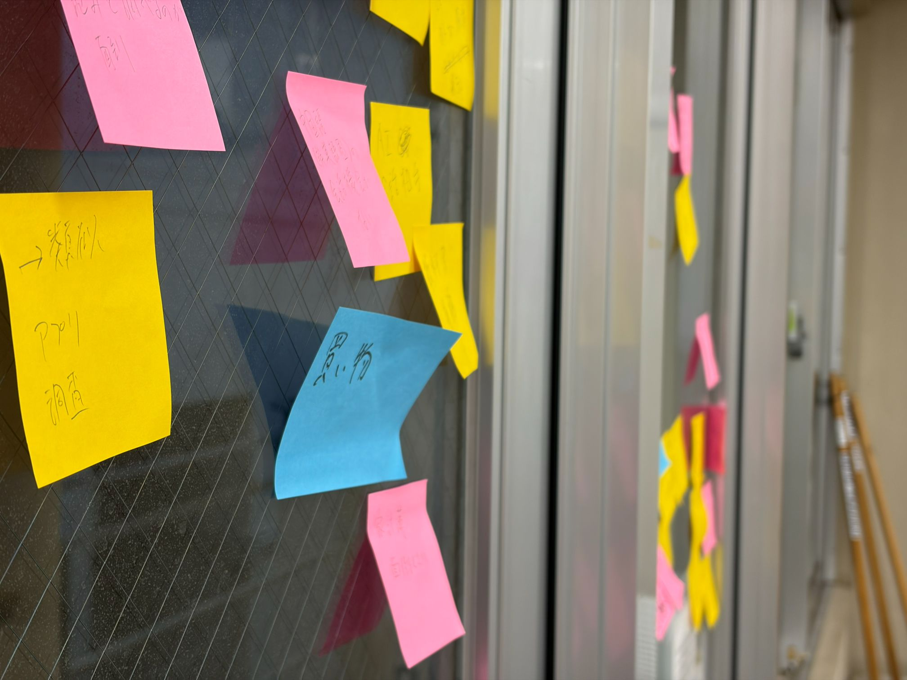
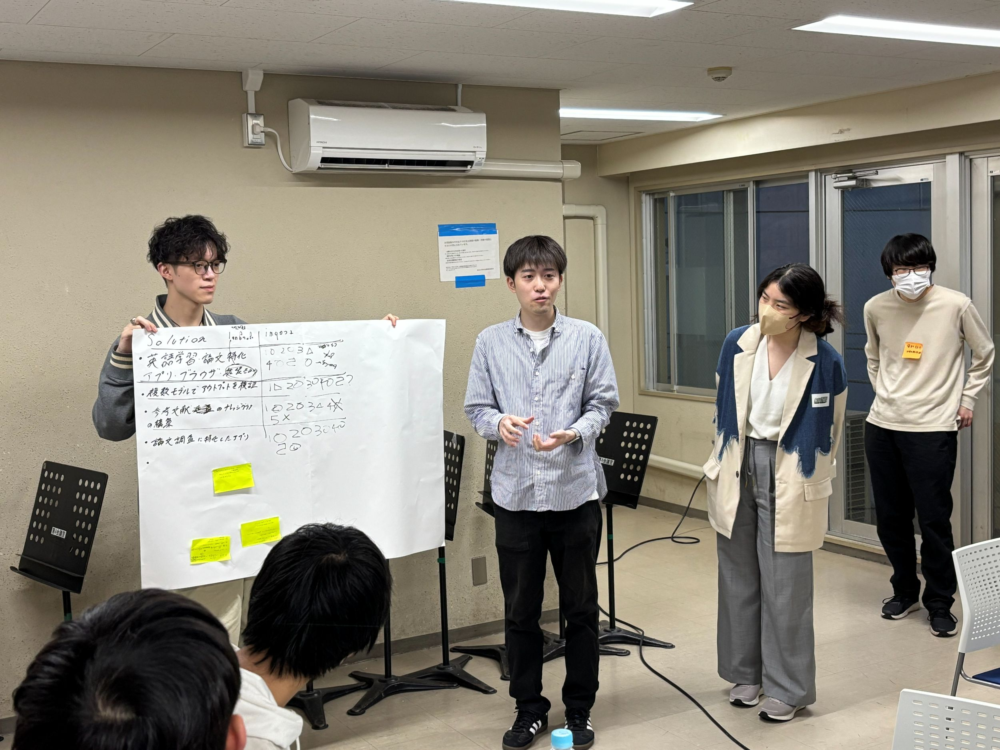

ut.code(); では、6 月 7 日に「プロジェクト発案会」を行いました。

## プロジェクト発案会の概要

プロジェクト発案会は、新しく立ち上げるプロジェクトのアイデアを見つけることを目的としたアイデアソン形式のイベントです。メンバーが技術を活かし、実際に使ってもらえるプロダクトづくりの第一歩として、チームに分かれてアイデアを出し合いました。

## チームに分かれてのディスカッション

今回は「生活」「学習」「コンピュータ」の領域でチームに分かれ、学習は 2 つのチームに分かれました。興味の近いメンバーで集まることで議論を深めやすくし、チームごとにアイデアの方向性が重ならないようにする狙いがあります。

各チームでは、身近な課題やふだん感じている困りごとを出発点に、それを解決するプロダクトのアイデアを話し合いました。どのチームも活発に意見を交わし、さまざまなアイデアが生まれていました。

## 発表

ディスカッションの最後には、各チームが考えたアイデアを発表しました。誰のどんな困りごとに向き合うのか、なぜそのアイデアなのかが共有され、発表後には質疑応答や他のチームからのコメントも交わされました。

## 今後

今回出たアイデアは、6 月 27 日に開催するプロジェクト発足会へと引き継がれます。取り組みたいテーマが決まったメンバーは、さらに検討を深めて発足会で発表し、一緒に開発する仲間を集めていきます。

ut.code(); では今後も、メンバーが自ら課題を見つけ、チームでプロダクトを形にしていく活動を続けていきます。
