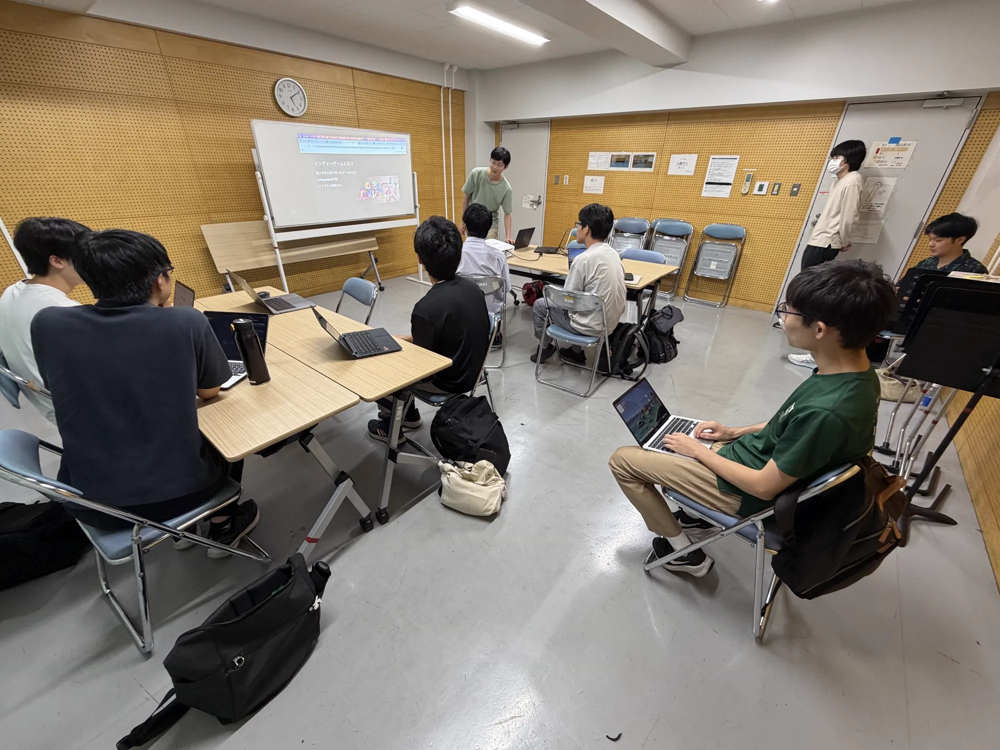
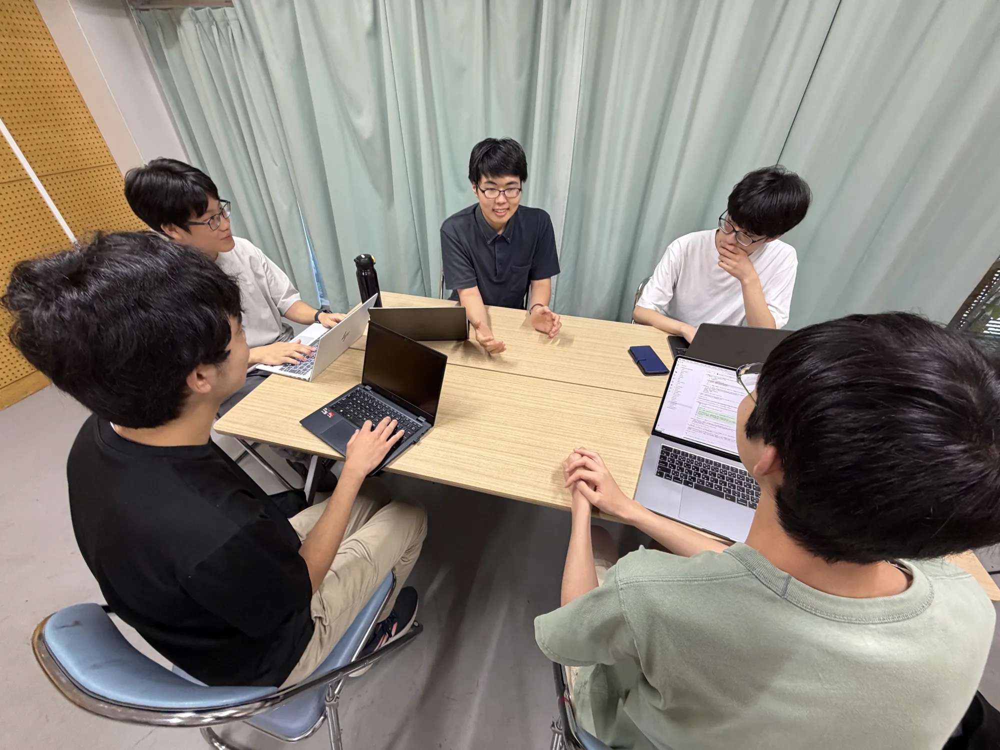
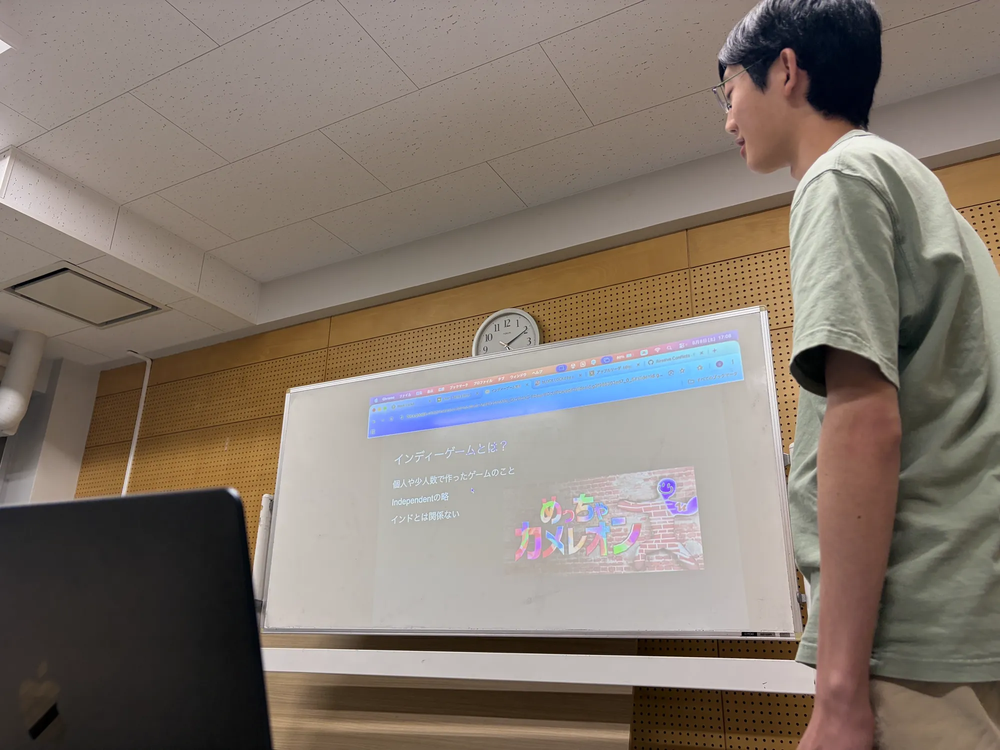

ut.code(); では、8 月 8 日に 2026 年 7 月総会を行いました。
7 月はテスト期間と重なるため、今回はテスト明けの 8 月に開催しました。
帰省中のメンバーもいるため、オンラインとのハイブリッド形式での実施となりました。

## 新プロジェクトの報告会

今回の総会は、7 月から発足した新プロジェクトの報告会がメインテーマでした。
プロジェクト発案会・発足会を経て立ち上がった各チームが、プロジェクトの概要や現在の進捗、今後の予定について発表しました。
発表後には質疑応答が活発に行われ、チームを越えて情報交換をする良い機会となりました。

## LT 会

総会の後半では、LT (Lightning Talk) 会を行いました。
メンバーそれぞれが、最近取り組んでいる開発や気になっている技術について発表しました。
短い時間ながら幅広いテーマの話を聞くことができ、オンライン参加のメンバーも交えて感想や質問が飛び交いました。

## おわりに

夏休みに入り、開発にまとまった時間を使える時期になりました。
ut.code(); では 8 月から 9 月を夏休み集中開発期間としており、発足したばかりの新プロジェクトがどのように進んでいくのか楽しみです。

今後は夏合宿や秋新歓といったイベントも控えています。
次回の総会での進捗報告にもご期待ください！
