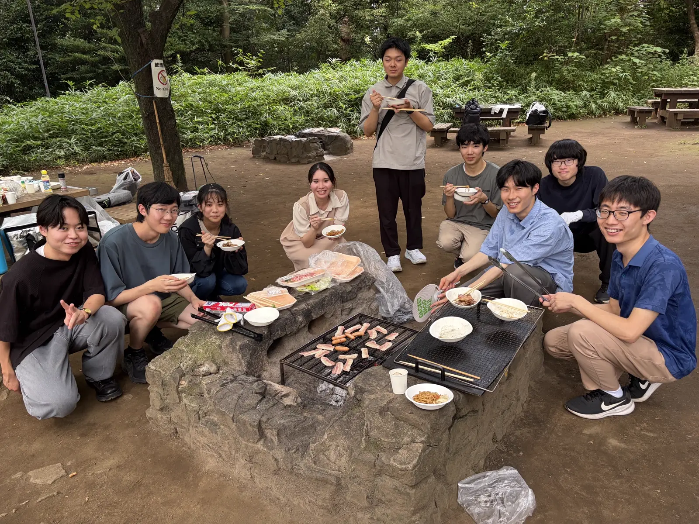
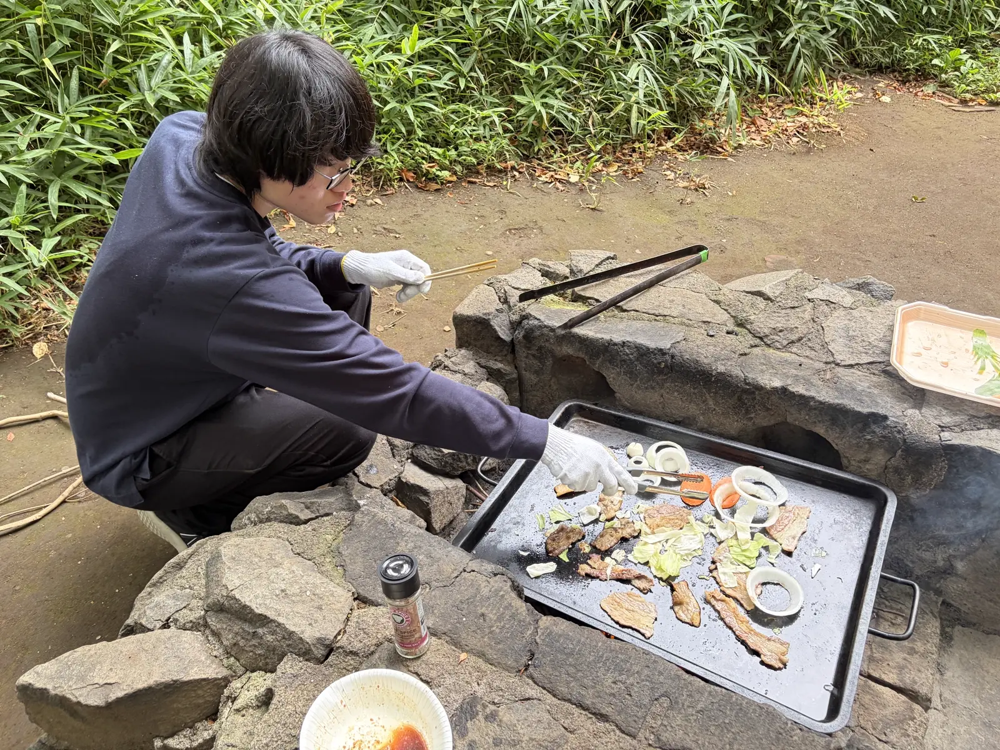

ut.code(); では、8 月 22 日に駒場野公園バーベキュー場でプロジェクト間交流会として BBQ を行いました。
夏休み集中開発期間の息抜きを兼ねて、普段は別々のプロジェクトで活動しているメンバーが集まりました。

## 当日の様子

集合後は、買い出しや設営、火おこしを手分けして行いました。
その後は肉や野菜を焼きながら、プロジェクトの話から雑談まで、ゆっくりと話す時間を過ごしました。

途中から参加したり、用事で早めに抜けたりするメンバーもいましたが、それぞれの都合に合わせて気軽に参加できる会になりました。

片付けを終える頃には雨が降り始め、最後は少し慌ただしい撤収となりました。
終わりは雨に見舞われる形になりましたが、それも含めて夏らしい一日として、メンバーの記憶に残る会になったのではないかと思います。

## おわりに

普段の作業会では各自の開発に集中していることが多いですが、火を囲みながらゆっくり話す時間は、メンバー同士の距離を縮める良い機会になりました。

まだまだ暑い日が続きますが、夏休みの残りでそれぞれのプロジェクトをしっかり前に進めて、9 月の夏合宿を迎えたいと思います。
