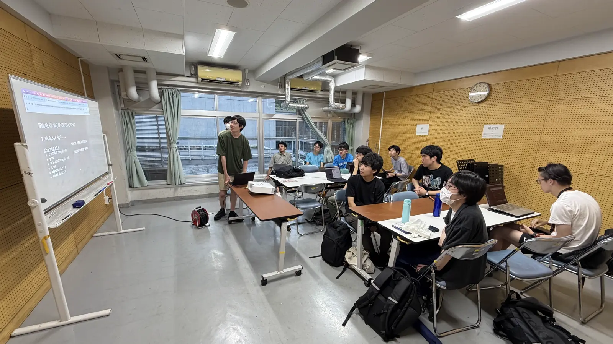
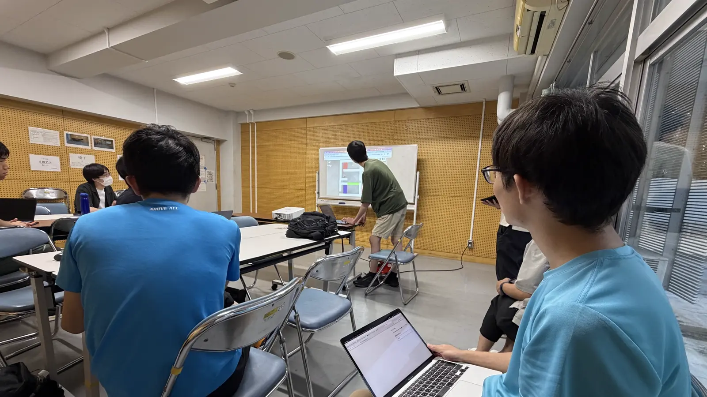
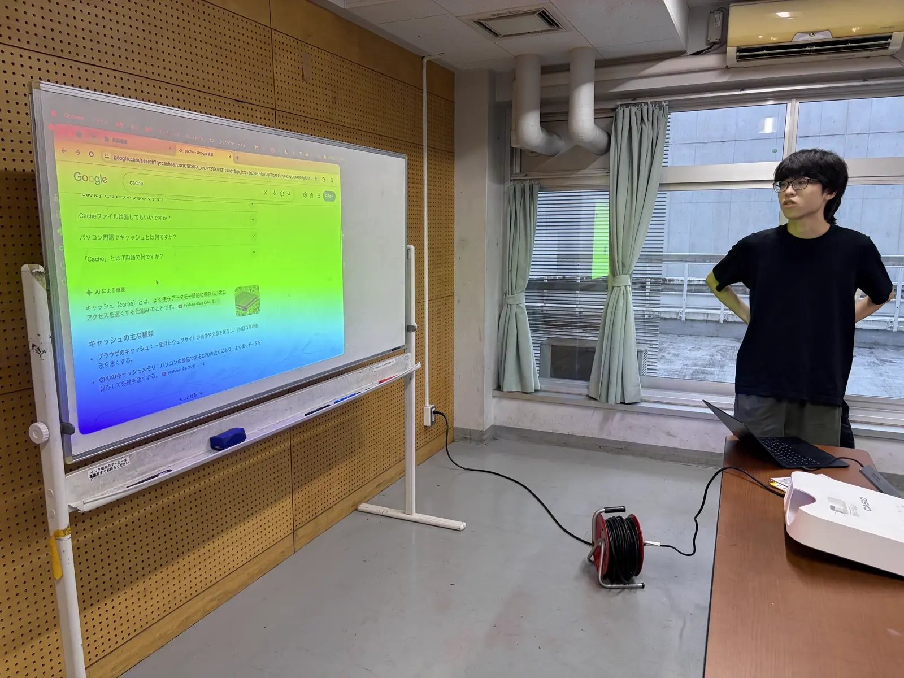

ut.code(); では、8 月 29 日に 2026 年 8 月総会を開催しました。
帰省などで各地に散らばっているメンバーも参加できるよう、今回も会場とオンラインを Discord でつなぐハイブリッド形式です。

## プロジェクトの進捗報告

夏休み集中開発期間もちょうど折り返しということで、今回も各プロジェクトがこの 1 か月の進捗を持ち寄りました。
7 月に発足したばかりのプロジェクトからも、動き始めた機能のデモや、設計を検討する中で見えてきた課題など、それぞれの現状の発表がありました。
質疑応答では、技術的な質問や提案から、広報の手法に関する意見まで、幅広い議論が交わされました。

## LT 会

後半は恒例となりつつある LT 会です。
ふだん使っている技術の紹介から、コンピューターの仕組みに踏み込んだ解説まで、思い思いのテーマでの発表が続きました。

## おわりに

夏休みも後半に入りました。
互いの進捗を確かめ合った今回の総会が、残りの期間の開発の弾みになればと思います。

次回の ut.code(); 総会は 9 月 26 日（土）に行われる予定です。
1 か月後、各プロジェクトがどんな姿になっているのか楽しみです。
